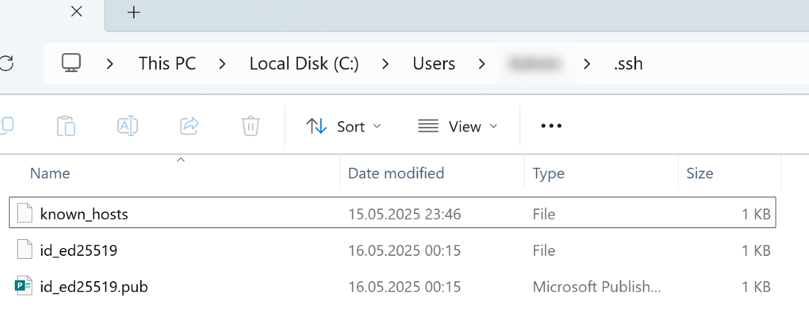
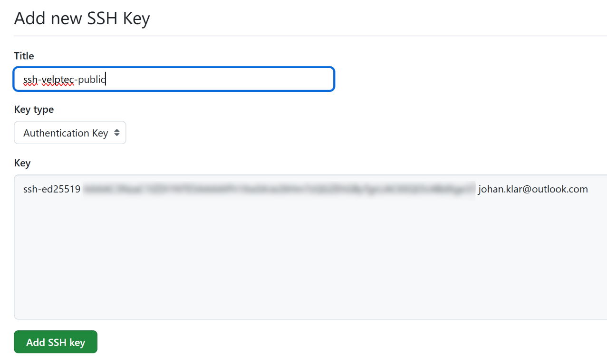
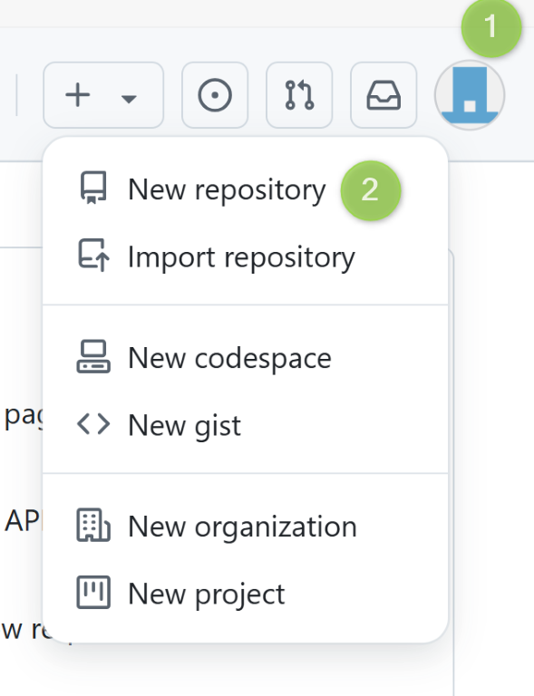
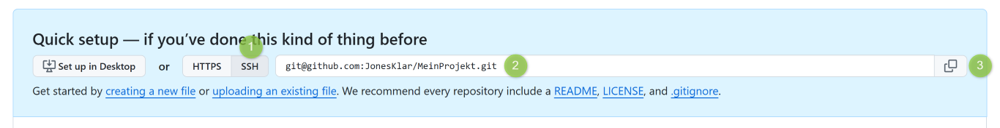
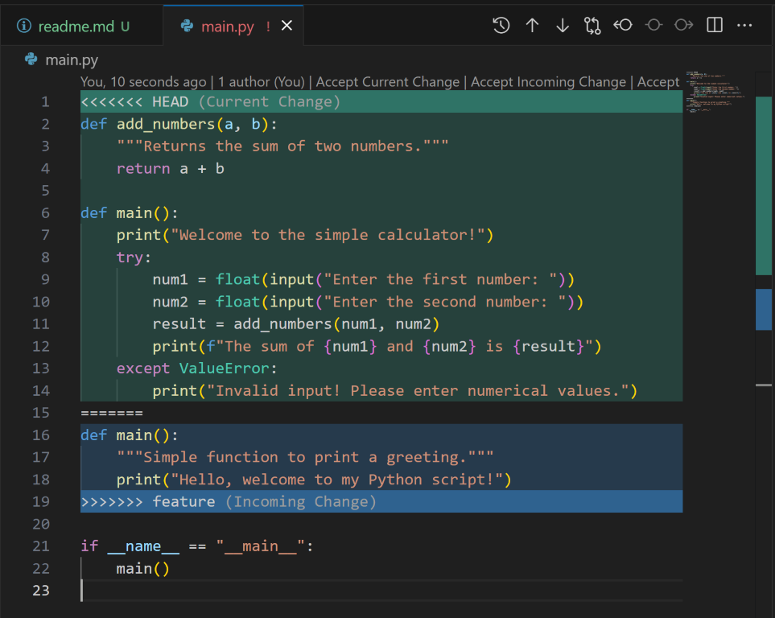

# Dokumentation

Erstelle eine README-Datei im Wurzelverzeichnis deines lokalen Repositories.
Dokumentiere in der README-Datei die folgenden Punkte:

## Erstellen eines ssh-Schlüsselpaares

ssh-keys generieren   

In der Git Bash Konsole folgendes Kommando eingeben (Default Pfad oder eigenen Pfad nutzen)

    ssh-keygen -t ed25519 -C "your_github_account_email@example.com"

Generierte Schlüssel:

Die Datei ".pub" ist der öffentliche Schlüssel.
Öffne diesen mit Notepad und notiere dir den gesamten Inhalt. Dieser wird später in Github registriert.

Start den lokalen ssh service. Öffne dazu die Powershell Konsole mit Admin Rechten:

In einer einfachen Windows Shell ohne Adminrechte folgeenden befehl ausführen, um den privaten `ssh` Schlüssel dem lokalen ssh Agent hinzuzufügen

##  Einrichten des GitHub-Repositorys "MeinProjekt"

### Public key registrieren

Auf github.com mit E-Mail Adresse einloggen/registrieren. Die E-Mail muss die gleiche sein, mit der vorher die `ssh` Schlüssel generiert worden sind.

Öffentlichen `ssh` Schlüssel im Github Account eintragen, folgende Schritte:

1. www.github.com aufrufen
2. Auf eigenes Profilbild klicken und dann auf `Settings`
3. Im Bereich `Access` auf `SSH und GPG keys` klicken
4. Zuvor generierten öffentlichen Schlüssel eintragen und mit `Add SSH key` bestätigen
 

Registrierter `public ssh key`

### Neues Repository "MeinProjekt" erstellen

Gehe zu GitHub (www.github.com) und melde dich mit deinem Benutzerkonto an. Falls du noch kein Konto hast, registriere dich kostenlos.

Nach dem Login klicke auf "+ New" (oben rechts) und erstelle ein neues leeres Repository mit dem Namen "MeinProjekt".

Notiere dir die URL des erstellten Repositories, sie wird später benötigt.

Projektnamen eingeben und mit "Create repository bestätigen"

Auf der Projektseite die hier angezeigte git Projekturl notieren, die wir zum späteren Klonen mit ssh verwenden werden.

## Die Schritte, die du zum lokalen Klonen des Repositorys, zum Konfigurieren von Git und zum Erstellen der initialen Commits durchgeführt hast.

Gehe in deinem Terminal zu dem Verzeichnis, in dem du dein lokales Git-Repository erstellen möchtest.

Klone das GitHub-Repository "MeinProjekt" mit dem folgenden Befehl: bash git clone git@github.com:DeinBenutzername/MeinProjekt.git .
Ersetze "DeinBenutzername" durch deinen GitHub-Benutzernamen. Der Befehl klont das Repository auf deinen lokalen Rechner.

Navigiere in das geklonte Verzeichnis "MeinProjekt":

    cd MeinProjekt

Konfiguriere `git` mit deinem Namen und E-Mail, die mit GitHub verknüpft sind:

    git config user.name "Dein Name"
    git config user.email "deine_email@beispiel.com"

## Die Schritte, die du zum Erstellen des "feature"-Branches, zum Hinzufügen einer neuen Datei zu diesem Branch und zum Committen der Änderungen durchgeführt hast.

## Die Schritte, die du zum Mergen des "feature"-Branches in den "main"-Branch und zum Beheben des dabei auftretenden Merge-Konflikts durchgeführt hast.

Resolved conflict:

Verwende Screenshots oder Code-Blöcke, um deine Erklärungen zu verdeutlichen.